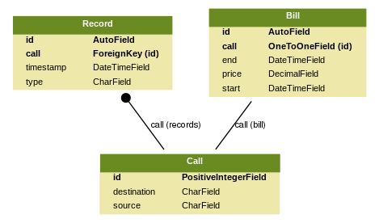

# Phone Manager API
[](https://travis-ci.org/brunobcardoso/phone-manager)
[](https://coveralls.io/github/brunobcardoso/phone-manager)

A web application to manage calls records, built with DJango and Django REST framework.
It receives call detail records and calculates monthly bills for a given telephone number.
The webservice can be accessed through the [link](https://phonemanager.herokuapp.com/).

## Prerequisites
This project requires Python3.7 and [Pipenv](https://pipenv.readthedocs.io/en/latest/).

## Installing

Clone the project and change directory
```console
git clone https://github.com/brunobcardoso/phone-manager
cd phone-manager
```
Once you have installed pipenv, just run `make install` and you are ready to go:
```console
make install
```
The development server will be running at: [http://localhost:8000/](http://localhost:8000/)

## Running the tests
Tests:
```console
make test
```
Coverage:
```console
make coverage
```

## Admin Panel
```console
make admin
```
The command above creates a superuser named `admin` with the password `pass`.

Admin Panel: [http://localhost:8000/admin/](http://localhost:8000/admin/)

## Usage

### Create a Call Start Record
*  `POST` `http://localhost:8000/records`

**Example**

request:
```console
curl -X POST \
  http://localhost:8000/records \
  -H 'Content-Type: application/json' \
  -d '{                                      
   "type":"start",
   "timestamp":"2018-01-10T21:50:13Z",
   "call_id":"101",
   "source":"1145678901",
   "destination":"11987654321"
}'
```

response:
```console
{
    "call_id": 101,
    "source": "1145678901",
    "destination": "11987654321",
    "type": "start",
    "timestamp": "2018-01-10T21:50:13Z"
}
```

### Create a Call End Record 
*  `POST` `http://localhost:8000/records`

**Example**

request:
```console
curl -X POST \
  http://localhost:8000/records \
  -H 'Content-Type: application/json' \
  -d '{                                      
   "type":"end",
   "timestamp":"2018-01-10T22:05:13Z",
   "call_id":"101"
}'
```

response:
```console
{
    "call_id": 101,
    "type": "end",
    "timestamp": "2018-01-10T22:05:13Z"
}
```

### Get telephone bill 

#### With just the subscriber telephone number
*  `GET` `http://localhost:8000/bills/<subscriber>`

**Example**

request:
```console
    curl -X GET http://localhost:8000/bills/1145678901 
```

response:
```console
{
    "subscriber": "1145678901",
    "reference_period": "08/2018",
    "bill_call_records": [
            {
            "destination": "11987654321",
            "call_start_date": "2018-08-28",
            "call_start_time": "13:29:33",
            "call_duration": "1h0m13s",
            "call_price": "R$ 5,76"
        }
    ]
}
``` 

#### With subscriber and reference period (month/year)
*  `GET` `http://localhost:8000/bills/<subscriber>?reference=MM/YYYY`

**Example**

request:

```console
curl -X GET 'http://localhost:8000/bills/1145678901?reference=01-2018'
```
response:

```console
{
    "subscriber": "1145678901",
    "reference_period": "01/2018",
    "bill_call_records": [
        {
            "destination": "11987654321",
            "call_start_date": "2018-01-10",
            "call_start_time": "21:50:13",
            "call_duration": "0h15m0s",
            "call_price": "R$ 1,26"
        },
        {
            "destination": "11987654321",
            "call_start_date": "2018-01-11",
            "call_start_time": "08:10:25",
            "call_duration": "0h45m0s",
            "call_price": "R$ 4,41"
        }
    ]
}
```

### Pricing Rules
The pricing related variables are stored at the project settings file
`phonemanager/settings.py`, with a default value as follow:

| Environment Variable  |             Description            | Default |
|-----------------------|:----------------------------------:|--------:|
| `STD_HOUR_START`      |      Standard time call start      |      06 |
| `STD_HOUR_END`        | Standard time call end (excluding) |      22 |
| `STD_STANDING_CHARGE` |      Standard Standing charge      |    0.36 |
| `STD_MINUTE_CHARGE`   |     Standard Call charge/minute    |    0.00 |
| `RDC_STANDING_CHARGE` |       Reduced Standing charge      |    0.36 |
| `RDC_MINUTE_CHARGE`   |     Reduced Call charge/minute     |    0.00 |

To change this variables for development purposes, set the variable in
`.env` file, and run the development server
```console
make run
```

## Entity Relationship Diagram(ERD)



To keep the Database documentation synchronized with the source code, run `make erd`.
It will generate a graphical representation of app `core` models. 
For a complete ERD, run `make cerd` instead.
```console
make erd
```

## Deploy to Heroku
```console
heroku create
heroku addons:create heroku-postgresql:hobby-dev --app <your_app_name>
heroku plugins:install heroku-config
heroku config:set SECRET_KEY=<your_secret_key>
heroku config:set ALLOWED_HOSTS=['your_app_name.herokuapp.com’]
git push heroku master
heroku ps:scale web=1
```
To update any Pricing rule variable, run:
 ```console
heroku config:set <ENV_VARIABLE_NAME>=<new_value>
```
Or create an .env file with all then and just run `heroku config:push -a`
from the same directory:
 ```console
heroku config:push -a
```
It will send configs from .env to Heroku

## Work environment
|                       |                  |
|-----------------------|------------------|
| Computer              | Dell Vostro 5480 |
| S.O.                  | Linux Mint 19    |
| IDE                   | PyCharm          |
| Python                | 3.7.0            |
| Pipenv                | 2018.7.1         |
| Git-flow              | 1.11.0           |
| Django                | 2.1.1            |
| Django REST framework | 3.8.2            |
